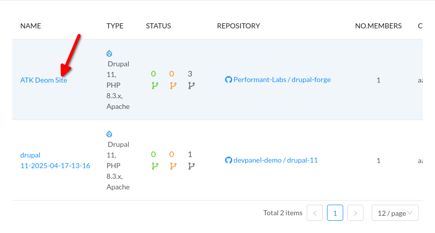
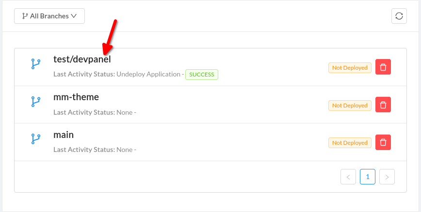
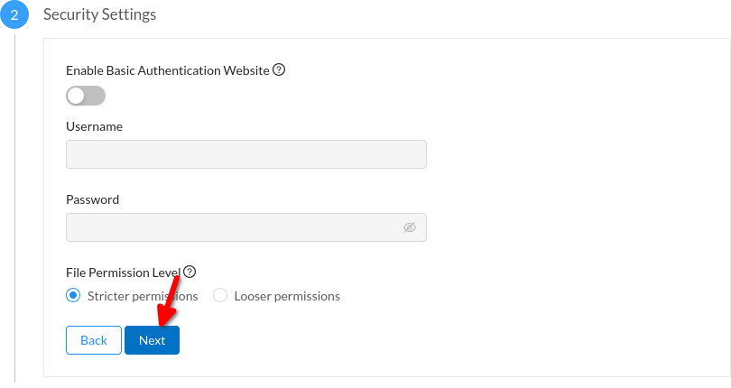
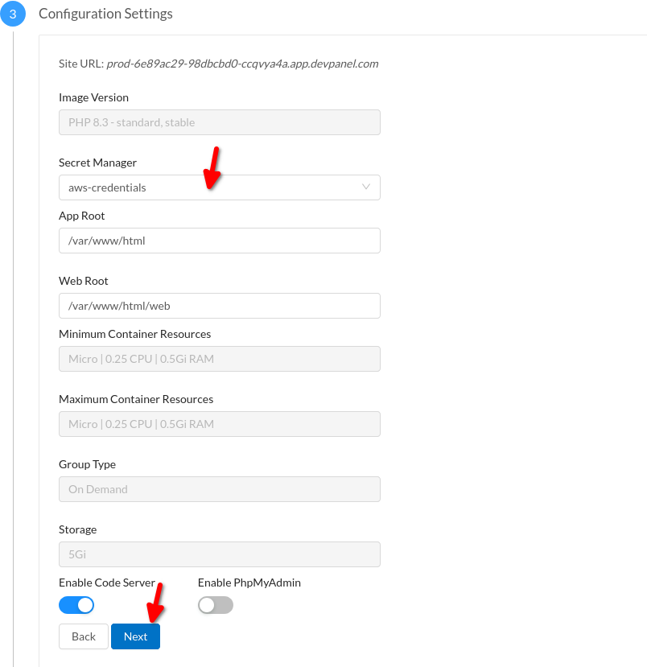

# drupal-forge

## Development Environment (DDEV) Installation

```shell
ddev start
ddev composer install
ddev drush site:install --account-name=admin --account-pass=password -y
ddev drush en pl_drupal_forge -y
ddev launch
```

## Configuration
See [pl_drupal_forge.settings.yml](web/modules/pl_drupal_forge/config/install/pl_drupal_forge.settings.yml).
AWS shares the credentials from ~/.aws (via [docker-compose.aws.yml](.ddev/docker-compose.aws.yml)).
If you don't have AWS configured on the host machine, do the following steps:
 - copy .aws directory to home: `cp -r ./.aws ~`
 - replace `[XXX]` with actual keys

You should have the `credentials` and `config` files in your ~/.aws directory.
Restart DDEV.

## Usage
Open "Test Me!" page and follow the instructions.

## Recipe

In order tests to pass, Drupal installation must have
`drupal/automated_testing_kit_demo_recipe` recipe applied.

```shell
ddev composer config allow-plugins.ewcomposer/unpack true
ddev composer config repo.recipe-unpack vcs https://github.com/woredeyonas/Drupal-Recipe-Unpack.git
ddev composer require ewcomposer/unpack:dev-master
ddev composer require drupal/automated_testing_kit_demo_recipe
ddev drush cr
ddev composer unpack drupal/automated_testing_kit_demo_recipe
ddev drush recipe ../recipes/automated_testing_kit_demo_recipe -v
```

## Exposing local installation to the Internet

To run tests against the local Drupal installation, set up
[ngrok](https://ngrok.com/docs/getting-started/?os=linux).
Then run:
```shell
ddev share
```

## Exposing SSH to the Internet
The command above will expose http port only. To expose SSH (which
is needed for executing Drush commands from the tests), do the following.

Authorize your SSH keys to DDEV. Restart.
Authorize ATK Lambda Function's SSH keys (the following command implying that they are
in the same directory).
```shell
ddev auth ssh -d ~/.ssh/
ddev restart
```

Check out SSH port mapping.
```shell
ddev describe
```

You should see a line like this:
```text
- web:22 -> 127.0.0.1:32832
```

Check that you can connect to the container. Determine your username in the container:
```shell
ddev ssh
whoami
```

Exit the container. In the command below, replace the port from the `ddev describe`
above and your username from above. If this works, exit the shell afterwards.
```shell
ssh -o StrictHostKeyChecking=no -p <port> -o SetEnv=IS_DDEV_PROJECT=true <username>@localhost
```

Now it's time to connect ngrok. Fetch the ngrok authorization token from [https://dashboard.ngrok.com/get-started/your-authtoken](https://dashboard.ngrok.com/get-started/your-authtoken).

Create `ngrok.yml` with the following content. Replace authorization token.
<port_web> and <port_ssh> come from `ddev describe`.
```yaml
version: 2
authtoken: '[xxx]'
tunnels:
  web:
    proto: http
    addr: http://127.0.0.1:<port_web:80>
  ssh:
    proto: tcp
    addr: <port_ssh:22>
```

Run:
```shell
ngrok start --config ngrok.yml --all
```

You should see two ports forwarding:
```text
Forwarding                    tcp://0.tcp.ngrok.io:10186 -> localhost:32832
Forwarding                    https://17368dc6c817.ngrok.app -> http://127.0.0.1:32833
```

Open another terminal and check that you can connect to the container. Take the username from above,
the host and port from the tcp://<ngrok_host>:<ngrok_port>.
```shell
ssh -o StrictHostKeyChecking=no -p <ngrok_port> -o SetEnv=IS_DDEV_PROJECT=true <username>@<ngrok_host>
```

You should log in and see something like:
```shell
Warning: Permanently added '[4.tcp.ngrok.io]:12859' (ED25519) to the list of known hosts.
Linux pl-drupal-forge-web 6.13.7-orbstack-00283-g9d1400e7e9c6 #104 SMP Mon Mar 17 06:15:48 UTC 2025 aarch64
```

Exit the ssh shell.

Now, to run SSH commands from the tests, module settings should be updated.

Check module settings:
```shell
ddev drush cget pl_drupal_forge.settings targetSite
```

You should see something like this:
```shell
'pl_drupal_forge.settings:targetSite':
  isTarget: true
  host: 0.tcp.ngrok.io
  port: 13353
  username: ilya
```

These may be wrong. Update the host, port, and username. For example:
```shell
ddev drush cset pl_drupal_forge.settings targetSite.host <ngrok_host>
ddev drush cset pl_drupal_forge.settings targetSite.port <ngrok_port>
ddev drush cset pl_drupal_forge.settings targetSite.username <username>
```

Double-check the module settings. Launch the site.

If asked for a URL, type the domain ngrok provided into the text field. Something like:
```https://e133f2aa8f88.ngrok.app/```


Run the tests.


## Devpanel Installation

Sing in into [devpanel](https://staging.site.devpanel.com/workspaces). Open the demo
workflow.


Click to the "ATK Demo" project.



Click to the branch you want to deploy.



On step 1, leave all default settings and click Next.


On step 2, leave all default settings and click Next.



On step 3, select Secret Manager "aws-credentials", and click Next.



Wait while the application is deployed.
